Executive Summary

I will:

1) Design an improved Project Architecture Document (PAD) aligned with:
- The refined MVP PRD (single clinic, senior-first, 4-week build).
- The `database_schema.sql` we defined (Supabase, RLS, PDPA-aware).

2) Provide the complete `Project_Architecture_Document.md` contents:
- Clear goals and constraints.
- System overview.
- File/folder hierarchy with key files and responsibilities.
- Mermaid diagrams:
  - Application logic flow.
  - User ↔ modules interactions.
- Key API route skeletons wired to the schema.

3) Define an implementation plan:
- How a single developer uses this PAD to scaffold and build the system.
- Validation checklist to ensure the PAD is practical, coherent, and safe.

I will first present the PAD (as the replacement document).
Then I’ll outline and review the implementation plan.

---------------------------------
Project_Architecture_Document.md
---------------------------------

Title: Gabriel Family Clinic MVP v1.0 – Project Architecture Document

1. Purpose and Scope

This document defines the practical, implementable architecture for the Gabriel Family Clinic MVP platform.

It is optimized for:
- One neighborhood clinic.
- One careful developer.
- A 4-week path to a safe, working system.
- Zero DevOps overhead (Supabase + Vercel).
- Senior-first usability.
- PDPA-conscious handling of personal and clinical data.

This PAD is the single source of truth for:
- Tech stack.
- Folder structure.
- Data model.
- API contracts.
- Auth + RLS strategy.
- How all parts fit together.

If a decision is not in this document, keep it simple by default.

2. High-Level Architecture Overview

2.1 Core Principles

- One clinic:
  - No multi-tenant complexity.
- One identity:
  - Supabase Auth `auth.uid()` drives all access control.
- One patient profile per user:
  - `patient_profiles.user_id = auth.uid()`.
- One small set of roles:
  - `staff`, `doctor`, `admin` via `staff_profiles`.
- RLS everywhere:
  - Patients see only their data.
  - Staff/doctor/admin see what they need.
- Boring tools:
  - Next.js (Pages Router) + Supabase + Twilio.
- Minimal features:
  - v1 is booking + basic queue + simple views.

2.2 System Components

- Client:
  - Patient-facing web app:
    - Registration/login.
    - Profile setup.
    - Booking.
    - View upcoming appointments.
  - Staff/doctor portal:
    - Today’s appointments.
    - Status changes (arrived, in consult, completed, no-show).
    - Queue control.

- Backend:
  - Next.js API Routes:
    - Auth/session helpers.
    - Reading/writing to Supabase (server-side).
    - Sending SMS/WhatsApp via Twilio.

- Data:
  - Supabase Postgres:
    - `patient_profiles`, `staff_profiles`, `doctors`, `clinic_settings`, `appointments`, `notifications`.
  - RLS policies enforced in DB.

- Integrations:
  - Supabase Auth:
    - Phone OTP (and/or email) for login.
  - Twilio:
    - SMS (and optional WhatsApp) for confirmation/reminders.

3. Project Structure

Root layout (pragmatic, senior-developer-friendly):

```text
gabriel-clinic-mvp/
  Project_Architecture_Document.md
  package.json
  tsconfig.json
  next.config.js
  .env.example
  database_schema.sql
  deploy_database.py
  run_database_deploy.sh

  /src
    /pages
      index.tsx
      book.tsx
      login.tsx
      profile.tsx

      /staff
        index.tsx
        login.tsx
        appointments.tsx

      /api
        /auth
          start-otp.ts
          verify-otp.ts
        /patient
          profile.get.ts
          profile.put.ts
        /doctors
          index.get.ts
        /slots
          index.get.ts
        /appointments
          book.post.ts
          mine.get.ts
        /staff
          appointments.get.ts
          appointment-status.post.ts
        /cron
          reminders.post.ts

    /components
      /layout
        PublicLayout.tsx
        StaffLayout.tsx
      /ui
        PrimaryButton.tsx
        TextField.tsx
        SelectField.tsx
      /patient
        BookingForm.tsx
        LoginForm.tsx
        ProfileForm.tsx
        UpcomingAppointmentsList.tsx
      /staff
        StaffLoginForm.tsx
        TodayAppointmentsTable.tsx
        QueueControls.tsx

    /lib
      supabaseClient.ts
      supabaseServer.ts
      auth.ts
      slots.ts
      queue.ts
      notifications.ts
      validation.ts
      config.ts

    /types
      models.ts
      supabase.ts  // optional generated types

    /styles
      globals.css
      layout.module.css

  /supabase
    schema.sql        // copy or split of database_schema.sql for Supabase migrations
    config.toml

  /tests
    /unit
    /integration
    /e2e

  /docs
    prd.md
    runbook.md
```

3.1 Key Files and Responsibilities

- `Project_Architecture_Document.md`:
  - This document. Architecture source of truth.

- `database_schema.sql`:
  - Canonical DB schema + RLS, as previously defined.

- `deploy_database.py` + `run_database_deploy.sh`:
  - Initialize local/custom Postgres.
  - For Supabase, use `schema.sql` via `supabase db push` instead.

- `src/lib/supabaseClient.ts`:
  - Browser-side Supabase client (anon key).
  - For non-sensitive reads where allowed.

- `src/lib/supabaseServer.ts`:
  - Server-side Supabase client with service role key.
  - Used only in API routes (never in browser).

- `src/lib/auth.ts`:
  - Helpers:
    - `getUserFromRequest(req)`
    - `requireAuth(req)`
    - `requireStaff(req)`
  - Wrap Supabase Auth token parsing.

- `src/lib/slots.ts`:
  - Slot calculation logic:
    - Reads `clinic_settings` and `appointments`.
    - Returns available time windows (next X days).

- `src/lib/queue.ts`:
  - Queue number assignment:
    - Look up latest `queue_number` for doctor/day.
    - Generate next (e.g. A001 → A002).

- `src/lib/notifications.ts`:
  - Twilio integration:
    - `sendBookingConfirmation()`
    - `sendReminder()`
    - Non-fatal on failure.

- `src/pages/book.tsx`:
  - Simple booking page:
    - Uses `BookingForm`.

- `src/pages/staff/appointments.tsx`:
  - Staff view:
    - Today’s appointments, state transitions, queue control.

Everything else is a thin wrapper around these core responsibilities.

4. Application Logic Flow

4.1 Patient Booking Flow (End-to-End)

```mermaid
sequenceDiagram
    participant P as Patient (Mdm. Tan)
    participant UI as Web UI (Next.js)
    participant API as API Routes
    participant SA as Supabase Auth
    participant DB as Supabase DB
    participant TW as Twilio (SMS/WhatsApp)
    participant ST as Staff UI

    %% Login / OTP
    P->>UI: Open /book
    UI->>P: Show "Enter mobile number"
    P->>API: POST /api/auth/start-otp (phone)
    API->>SA: Request OTP for phone
    SA-->>P: SMS with OTP

    P->>API: POST /api/auth/verify-otp (phone, otp)
    API->>SA: Verify OTP
    SA-->>API: auth.user (user_id)
    API->>P: Set auth session (cookie / token)

    %% Profile
    UI->>API: GET /api/patient/profile
    API->>DB: SELECT patient_profiles WHERE user_id = auth.uid()
    DB-->>API: None (first time)
    API->>UI: Prompt profile form

    P->>API: PUT /api/patient/profile (name, NRIC, DOB, language)
    API->>DB: INSERT patient_profiles (user_id = auth.uid(), nric_hash, nric_masked)

    %% Booking
    UI->>API: GET /api/doctors
    API->>DB: SELECT doctors WHERE is_active = TRUE
    DB-->>API: Doctor list
    API-->>UI: Doctor list

    P->>UI: Choose doctor, date
    UI->>API: GET /api/slots?doctor_id&date
    API->>DB: Compute available slots from clinic_settings + appointments
    DB-->>API: Slots
    API-->>UI: Slots

    P->>API: POST /api/appointments/book (doctor_id, datetime)
    API->>DB: INSERT INTO appointments (patient_id from auth.uid())
    DB-->>API: Appointment row
    API->>TW: Send confirmation SMS
    TW-->>P: "✅ Appointment confirmed"

    %% Clinic Day
    ST->>UI: Staff login (/staff/login)
    ST->>API: GET /api/staff/appointments/today
    API->>DB: SELECT appointments + patient_profiles (RLS via staff_profiles)
    DB-->>API: Appointments
    API-->>ST: Today’s list

    ST->>API: POST /api/staff/appointment-status (id, 'arrived')
    API->>DB: UPDATE appointments SET status='arrived', queue_number=next_for_doctor()
    DB-->>API: OK

    %% Optional queue alert
    ST->>API: POST /api/staff/appointment-status (id, 'in_consultation')
    API->>DB: UPDATE appointments SET status='in_consultation'
    DB-->>API: OK
```



5. User and Modules Interaction Diagram

```mermaid
graph TB

  subgraph Users
    PATIENT[👤 Patient<br/>Mdm. Tan]
    STAFF[👥 Staff / Reception]
    DOCTOR[👨‍⚕️ Doctor]
    ADMIN[👨‍💼 Admin]
  end

  subgraph Frontend (Next.js)
    PATIENT_UI[Patient UI<br/>/book, /profile]
    STAFF_UI[Staff UI<br/>/staff/appointments]
    AUTH_UI[Auth UI<br/>/login]
  end

  subgraph Backend (API Routes)
    AUTH_API[/api/auth/*]
    PATIENT_API[/api/patient/*]
    DOCTORS_API[/api/doctors]
    SLOTS_API[/api/slots]
    APPTS_API[/api/appointments/*]
    STAFF_API[/api/staff/*]
    CRON_API[/api/cron/reminders]
  end

  subgraph Services (/lib)
    AUTH_SVCS[auth.ts<br/>getUser, requireStaff]
    SLOTS_SVCS[slots.ts<br/>slot logic]
    QUEUE_SVCS[queue.ts<br/>queue numbers]
    NOTIFY_SVCS[notifications.ts<br/>Twilio]
  end

  subgraph Infra
    SUPABASE[(Supabase<br/>Auth + Postgres + RLS)]
    TWILIO[(Twilio<br/>SMS/WhatsApp)]
  end

  PATIENT --> PATIENT_UI
  PATIENT --> AUTH_UI
  STAFF --> STAFF_UI
  DOCTOR --> STAFF_UI
  ADMIN --> STAFF_UI

  PATIENT_UI --> AUTH_API
  PATIENT_UI --> PATIENT_API
  PATIENT_UI --> DOCTORS_API
  PATIENT_UI --> SLOTS_API
  PATIENT_UI --> APPTS_API

  STAFF_UI --> AUTH_API
  STAFF_UI --> STAFF_API
  STAFF_UI --> APPTS_API

  AUTH_API --> AUTH_SVCS
  PATIENT_API --> AUTH_SVCS
  DOCTORS_API --> SUPABASE
  SLOTS_API --> SLOTS_SVCS
  APPTS_API --> QUEUE_SVCS
  APPTS_API --> SUPABASE
  STAFF_API --> AUTH_SVCS
  STAFF_API --> SUPABASE
  CRON_API --> NOTIFY_SVCS

  AUTH_SVCS --> SUPABASE
  SLOTS_SVCS --> SUPABASE
  QUEUE_SVCS --> SUPABASE
  NOTIFY_SVCS --> TWILIO

  style PATIENT fill:#e3f2fd
  style STAFF fill:#fff3e0
  style DOCTOR fill:#fff3e0
  style PATIENT_UI fill:#e8f5e9
  style STAFF_UI fill:#e8f5e9
  style AUTH_API fill:#fce4ec
  style SUPABASE fill:#f3e5f5
```

6. Key API Route Skeletons (Aligned with Schema)

Note: These are high-level skeletons; actual implementation will import the real Supabase server client and auth helpers. All code blocks are examples and must be tailored to your environment and auth strategy.

6.1 `src/lib/supabaseServer.ts`

```ts
import { createClient } from '@supabase/supabase-js';

const supabaseUrl = process.env.SUPABASE_URL!;
const serviceRoleKey = process.env.SUPABASE_SERVICE_ROLE_KEY!;

export const supabaseServer = createClient(supabaseUrl, serviceRoleKey, {
  auth: {
    persistSession: false
  }
});
```

6.2 `src/lib/auth.ts`

```ts
import { NextApiRequest } from 'next';
import { supabaseServer } from './supabaseServer';

export async function getUserFromRequest(req: NextApiRequest) {
  const token = req.headers.authorization?.replace('Bearer ', '') 
    || req.cookies['sb-access-token'];

  if (!token) return null;

  const { data, error } = await supabaseServer.auth.getUser(token);
  if (error || !data?.user) return null;

  return data.user;
}

export async function requireAuth(req: NextApiRequest) {
  const user = await getUserFromRequest(req);
  if (!user) throw new Error('UNAUTHORIZED');
  return user;
}
```

(Production: adapt to your Supabase auth integration pattern.)

6.3 `GET /api/doctors` – List Active Doctors

```ts
// src/pages/api/doctors/index.get.ts
import type { NextApiRequest, NextApiResponse } from 'next';
import { supabaseServer } from '@/lib/supabaseServer';

export default async function handler(req: NextApiRequest, res: NextApiResponse) {
  if (req.method !== 'GET') return res.status(405).end();

  const { data, error } = await supabaseServer
    .from('doctors')
    .select('id, name, photo_url, languages')
    .eq('is_active', true);

  if (error) {
    console.error('Error fetching doctors:', error);
    return res.status(500).json({ error: 'Failed to fetch doctors' });
  }

  return res.status(200).json({ doctors: data || [] });
}
```

6.4 `GET /api/slots` – Compute Available Slots

```ts
// src/pages/api/slots/index.get.ts
import type { NextApiRequest, NextApiResponse } from 'next';
import { getAvailableSlots } from '@/lib/slots';

export default async function handler(req: NextApiRequest, res: NextApiResponse) {
  if (req.method !== 'GET') return res.status(405).end();

  const { doctor_id, date } = req.query;
  if (!doctor_id || !date) {
    return res.status(400).json({ error: 'doctor_id and date are required' });
  }

  try {
    const slots = await getAvailableSlots(String(doctor_id), String(date));
    return res.status(200).json({ slots });
  } catch (e: any) {
    console.error('Error fetching slots:', e);
    return res.status(500).json({ error: 'Failed to fetch slots' });
  }
}
```

6.5 `POST /api/appointments/book` – Create Appointment

```ts
// src/pages/api/appointments/book.post.ts
import type { NextApiRequest, NextApiResponse } from 'next';
import { z } from 'zod';
import { supabaseServer } from '@/lib/supabaseServer';
import { requireAuth } from '@/lib/auth';
import { sendBookingConfirmation } from '@/lib/notifications';

const BookSchema = z.object({
  doctor_id: z.string().uuid(),
  scheduled_start: z.string().datetime()
});

export default async function handler(req: NextApiRequest, res: NextApiResponse) {
  if (req.method !== 'POST') return res.status(405).end();

  let user;
  try {
    user = await requireAuth(req);
  } catch {
    return res.status(401).json({ error: 'Unauthorized' });
  }

  const parse = BookSchema.safeParse(req.body);
  if (!parse.success) {
    return res.status(400).json({ error: 'Invalid input', details: parse.error.flatten() });
  }

  const { doctor_id, scheduled_start } = parse.data;

  try {
    // Find patient_profile
    const { data: profile, error: profileErr } = await supabaseServer
      .from('patient_profiles')
      .select('id, full_name')
      .eq('user_id', user.id)
      .single();

    if (profileErr || !profile) {
      return res.status(400).json({ error: 'Patient profile not found' });
    }

    // Insert appointment
    const { data: appt, error: apptErr } = await supabaseServer
      .from('appointments')
      .insert({
        patient_id: profile.id,
        doctor_id,
        scheduled_start,
        status: 'booked'
      })
      .select('id, scheduled_start')
      .single();

    if (apptErr || !appt) {
      console.error('Error creating appointment:', apptErr);
      return res.status(500).json({ error: 'Failed to create appointment' });
    }

    // Best-effort notification
    try {
      await sendBookingConfirmation(profile, appt);
    } catch (e) {
      console.warn('Notification failed:', e);
    }

    return res.status(201).json({
      success: true,
      appointment: appt
    });
  } catch (e) {
    console.error('Unexpected error:', e);
    return res.status(500).json({ error: 'Internal server error' });
  }
}
```

6.6 `GET /api/staff/appointments` – Today’s Appointments

```ts
// src/pages/api/staff/appointments.get.ts
import type { NextApiRequest, NextApiResponse } from 'next';
import { supabaseServer } from '@/lib/supabaseServer';
import { requireAuth } from '@/lib/auth';

export default async function handler(req: NextApiRequest, res: NextApiResponse) {
  if (req.method !== 'GET') return res.status(405).end();

  const user = await requireAuth(req);

  // Check staff role
  const { data: staff, error: staffErr } = await supabaseServer
    .from('staff_profiles')
    .select('role')
    .eq('user_id', user.id)
    .single();

  if (staffErr || !staff || !['staff', 'doctor', 'admin'].includes(staff.role)) {
    return res.status(403).json({ error: 'Forbidden' });
  }

  const today = new Date();
  const start = new Date(today.getFullYear(), today.getMonth(), today.getDate()).toISOString();
  const end = new Date(today.getFullYear(), today.getMonth(), today.getDate() + 1).toISOString();

  const { data, error } = await supabaseServer
    .from('appointments')
    .select(`
      id,
      scheduled_start,
      status,
      queue_number,
      patient:patient_profiles (full_name),
      doctor:doctors (name)
    `)
    .gte('scheduled_start', start)
    .lt('scheduled_start', end)
    .order('scheduled_start', { ascending: true });

  if (error) {
    console.error('Error fetching staff appointments:', error);
    return res.status(500).json({ error: 'Failed to fetch appointments' });
  }

  return res.status(200).json({ appointments: data || [] });
}
```

6.7 `POST /api/staff/appointment-status` – Update Status / Queue

```ts
// src/pages/api/staff/appointment-status.post.ts
import type { NextApiRequest, NextApiResponse } from 'next';
import { z } from 'zod';
import { supabaseServer } from '@/lib/supabaseServer';
import { requireAuth } from '@/lib/auth';
import { getNextQueueNumber } from '@/lib/queue';

const StatusSchema = z.object({
  appointment_id: z.string().uuid(),
  status: z.enum(['arrived', 'in_consultation', 'completed', 'no_show'])
});

export default async function handler(req: NextApiRequest, res: NextApiResponse) {
  if (req.method !== 'POST') return res.status(405).end();

  const user = await requireAuth(req);

  const { data: staff, error: staffErr } = await supabaseServer
    .from('staff_profiles')
    .select('role')
    .eq('user_id', user.id)
    .single();

  if (staffErr || !staff || !['staff', 'doctor', 'admin'].includes(staff.role)) {
    return res.status(403).json({ error: 'Forbidden' });
  }

  const parse = StatusSchema.safeParse(req.body);
  if (!parse.success) {
    return res.status(400).json({ error: 'Invalid input', details: parse.error.flatten() });
  }

  const { appointment_id, status } = parse.data;

  try {
    // If marking arrived and no queue_number, assign one
    if (status === 'arrived') {
      const { data: appt, error: apptErr } = await supabaseServer
        .from('appointments')
        .select('id, doctor_id, scheduled_start, queue_number')
        .eq('id', appointment_id)
        .single();

      if (apptErr || !appt) {
        return res.status(404).json({ error: 'Appointment not found' });
      }

      let queue_number = appt.queue_number;
      if (!queue_number) {
        queue_number = await getNextQueueNumber(appt.doctor_id, appt.scheduled_start);
      }

      const { error: updErr } = await supabaseServer
        .from('appointments')
        .update({ status, queue_number })
        .eq('id', appointment_id);

      if (updErr) throw updErr;

      return res.status(200).json({ success: true, queue_number });
    }

    // Other statuses: simple update
    const { error: updErr } = await supabaseServer
      .from('appointments')
      .update({ status })
      .eq('id', appointment_id);

    if (updErr) throw updErr;

    return res.status(200).json({ success: true });
  } catch (e) {
    console.error('Error updating status:', e);
    return res.status(500).json({ error: 'Failed to update status' });
  }
}
```

7. Implementation Plan (for the Improved PAD)

Goal:
- Turn this architecture into a functioning MVP in 4 weeks by a single developer.

Phase 1: Foundations (Days 1–3)

- Tasks:
  - Initialize Next.js + TypeScript project.
  - Add Mantine, Zod.
  - Set up Supabase project.
  - Apply `database_schema.sql` via Supabase migrations.
  - Configure environment variables:
    - Supabase URL, anon key, service role key.
    - Twilio keys (stub ok for dev).
  - Implement:
    - `supabaseClient.ts`
    - `supabaseServer.ts`
    - `auth.ts` (basic `getUserFromRequest`).

- Success criteria:
  - App boots locally.
  - Supabase connected.
  - Basic RLS-enabled schema online.

Phase 2: Patient Flows (Days 4–10)

- Tasks:
  - Implement:
    - `/login` with OTP flow (wired to Supabase Auth).
    - `/profile` page + `GET/PUT /api/patient/profile`.
    - `/book` page + `GET /api/doctors` + `GET /api/slots`.
    - `POST /api/appointments/book`.
  - Implement `BookingForm.tsx` with:
    - Doctor selection.
    - Date + time selection.
    - Error handling + success state.

- Success criteria:
  - Authenticated patient can:
    - Create profile.
    - Book appointment.
    - Receive console-log or real SMS confirmation in dev.

Phase 3: Staff Portal & Queue (Days 11–16)

- Tasks:
  - Seed `staff_profiles` and `doctors` rows.
  - Implement:
    - `/staff/login` (reuse Supabase Auth).
    - `/staff/appointments` view.
    - `GET /api/staff/appointments`.
    - `POST /api/staff/appointment-status`.
    - `QueueControls.tsx` UI.
  - Simple filtering for today’s appointments.

- Success criteria:
  - Staff can:
    - Log in.
    - View today’s appointments.
    - Mark “arrived” and see `queue_number` assigned reliably.

Phase 4: Notifications & Polish (Days 17–22)

- Tasks:
  - Implement `notifications.ts` with Twilio integration:
    - Best-effort confirmation SMS.
  - Implement simple 24h reminder:
    - `/api/cron/reminders` triggered by:
      - Supabase scheduled job or external cron.
  - UX polish:
    - Large buttons, clear text, mobile-friendly.

- Success criteria:
  - Booking triggers SMS in staging.
  - Reminder endpoint works when hit manually.

Phase 5: Testing, Validation, Launch Prep (Days 23–28)

- Tasks:
  - Manual testing of:
    - 10+ bookings.
    - Staff status updates.
    - RLS (patient cannot see others’ data).
  - Add a few unit/integration tests for:
    - Booking API.
    - Staff appointments API.
  - Create `docs/runbook.md`:
    - How to operate.
    - Fallback plan if system down.

- Success criteria:
  - Stable end-to-end flows.
  - Clinic staff trained in <30 minutes.
  - 3–5 seniors complete booking unaided in test.

8. Validation of the Improved PAD

Checklist:

- Aligned with improved PRD:
  - Yes: features limited to MVP-critical flows.
- Consistent with `database_schema.sql`:
  - Yes: all API skeletons use `patient_profiles`, `staff_profiles`, `doctors`, `appointments`, `notifications`.
- PDPA-aware:
  - Yes: NRIC handling is in schema, not in routes; access via `auth.uid()`.
- Implementable by one developer in 4 weeks:
  - Yes: bounded routes, clear structure, no over-engineering.
- Extensible:
  - Yes: can add MC PDFs, notes, CHAS logic later via incremental migrations and routes.
