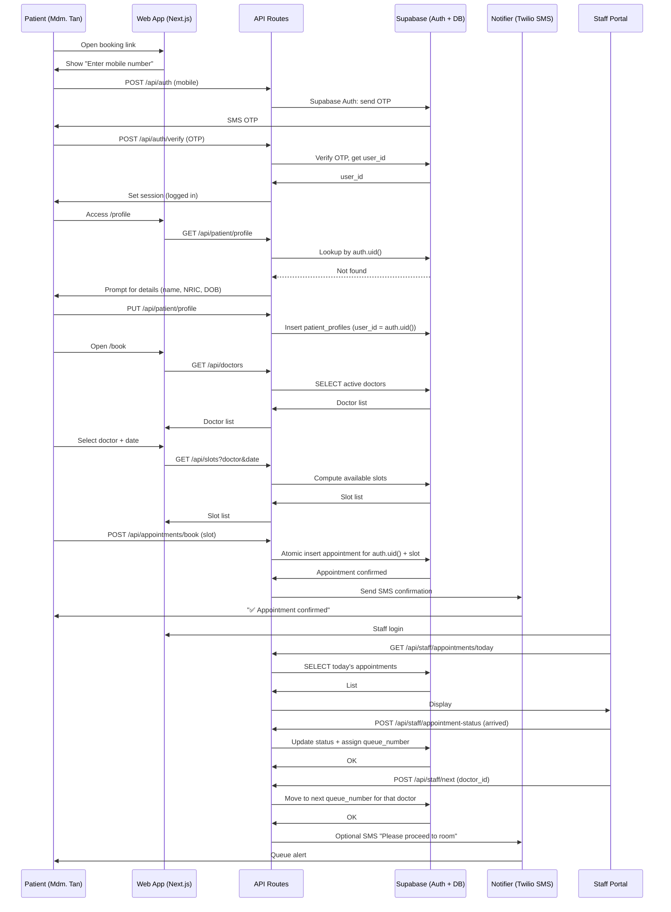

Executive Summary

You’ve got the right philosophy. Now we make it execution-proof.

I’ll do three things:

1) Deepen and harden your blueprint:
- Fix auth/RLS/compliance pitfalls.
- Enforce ruthless MVP prioritization.
- Remove hidden complexities that threaten a 4-week, 1-dev launch.

2) Propose an improved, concrete PRD:
- Practical, PDPA-conscious, Singapore-clinic-specific.
- Directly implementable with Supabase + Next.js + Twilio.
- Explicit about what is v1 vs later.

3) Provide a meticulous implementation plan:
- File hierarchy (with key files + responsibilities).
- Application flow (Mermaid).
- User-module interaction (Mermaid).
- Built so a single careful developer can ship and maintain it.

First I’ll outline the improved blueprint at a high level.
Then I’ll present the full replacement PRD/tech spec.
Then I’ll validate it against constraints and risks.

If you’re happy with this plan, next step (in a follow-up) is generating production-ready code scaffolding.

————————
Part 1: Strategic Improvements to the Current Blueprint
————————

Guiding constraints (non-negotiable):

- 1 clinic.
- 1 developer.
- 4 weeks to dependable go-live.
- Zero DevOps (Supabase + Vercel).
- Seniors can self-book without assistance.
- PDPA-compliant by design.
- No overbuilt architecture: only what we can operate.

Key improvements:

1. Auth & Identity: Fix the weakest link

Problems in current doc:
- NRIC too close to being an “account identifier.”
- RLS examples ambiguous / fragile.
- Placeholder patients created with garbage data.

Improved pattern:
- Supabase Auth as sole source of identity.
- Phone-based sign-in (OTP) as primary.
- Each authenticated user has exactly one `patient_profile`.
- NRIC stored securely and verified, but never used alone for access.

Implications:
- Safer PDPA posture.
- Cleaner RLS: `patient_profiles.user_id = auth.uid()`.
- NRIC misuse attacks are mitigated.

2. MVP Scope: One ruthlessly minimal slice

What absolutely must be in v1 (and nothing more):

For patients:
- Register/login with phone OTP.
- Create/link patient profile (NRIC, name, DOB, CHAS tier, language).
- Book appointment:
  - Choose doctor.
  - Choose date (next 7 days).
  - Choose time slot.
- Receive confirmation by WhatsApp and/or SMS.
- View upcoming appointment and basic visit history entries (optional, minimal).

For staff/doctors:
- Authenticated clinic staff/doctor portal (email-password or magic link).
- View today’s appointments.
- Mark:
  - Arrived
  - In consultation
  - Completed
  - No-show
- Increment “Now Serving” number (simple manual queue).

System:
- PDPA-safe data model and RLS.
- Basic audit logs for record access.
- Minimal reporting:
  - Daily appointment summary.

Everything else becomes:
- Phase 1.5 (MC PDFs, CHAS breakdown, more reminders).
- Phase 2+ (family linking, advanced analytics, telemed, etc.).

3. Queue & Slots: From “smart” to “safe and simple”

Improvements:
- Queue number:
  - Per doctor per day: A001, A002, ...
  - Generated via one small server-side atomic operation.
- Slots:
  - Pre-generated or computed on the fly based on schedule configuration.
  - Simple “booked or free” flag; no complex capacity logic.

4. Notifications: Remove fragility

Improvements:
- MVP:
  - Use Twilio SMS (and optionally WhatsApp) for:
    - Immediate confirmation
    - 24h reminder (via cron/Edge Function)
  - If WhatsApp approval is slow or painful, SMS alone is sufficient.
- Notification failures:
  - Must NOT break booking.
  - Logged in `notifications` table.

5. Compliance & Security: Make it implementable

Improvements:
- Clear RLS patterns, all `auth.uid()`-driven.
- NRIC:
  - Stored encrypted or hashed.
  - Only masked version shown on screen.
- Access:
  - Patients can only see their own profile and appointments.
  - Staff/Doctors only see clinic data via a “staff” role or dedicated table.
- Breach and backup story:
  - Supabase backups + minimal data scope.

With these improvements, we now define the replacement PRD.

————————
Part 2: Improved Replacement PRD (Practical, Implementable)
————————

Title: Gabriel Family Clinic MVP v1.0
Subtitle: One Clinic, One Simple System, One Happy Patient

1. Product Objectives

1.1 Primary Objective (90-day)

Enable Gabriel Family Clinic to:
- Let patients self-book appointments online.
- Reduce receptionist phone load.
- Provide simple, reliable queue visibility.
- Operate with PDPA-safe digital records.

1.2 Non-Goals (Deliberately Out of Scope for v1)

- Multi-clinic support.
- Telemedicine.
- Full EMR with complex histories & attachments.
- Automated CHAS claim submission.
- Complex analytics dashboards.
- In-app payments, PayNow integration beyond static QR display.
- AI features.

2. Core User Journeys (v1 Scope)

2.1 Patient (Mdm. Tan) – Booking

- Entry:
  - WhatsApp broadcast link OR printed QR in clinic → mobile web.

Flow:
- See welcome screen:
  - Large “Book Appointment” button.
- If not logged in:
  - Enter mobile number.
  - Receive OTP via SMS.
  - Verify.
- On first login:
  - Fill:
    - Full name.
    - NRIC.
    - DOB.
    - Language.
    - (Optional) CHAS tier.
  - Profile saved and tied to user.
- Booking:
  - Choose doctor (photo + name).
  - Choose date (next 7 days).
  - Choose time slot.
  - Confirm.
- After confirm:
  - Show:
    - Appointment details.
    - Simple queue note: “Queue number will be assigned on arrival” or “Expected window: X–Y”.
  - Send SMS/WhatsApp confirmation.

2.2 Receptionist / Staff – Daily Ops

- Login to staff portal.
- See “Today’s Appointments”:
  - Patient name, time, doctor, status.
- On arrival:
  - Click “Mark Arrived”.
  - System assigns queue number for that doctor/session if not yet assigned.
- On doctor call:
  - Doctor or staff clicks “Next Patient”:
    - Queue advances.
    - Optionally send “Please proceed to room” SMS/WhatsApp.

2.3 Doctor – Consultation View (Minimal)

- Login as doctor.
- View:
  - Today’s appointments.
  - For each: name, reason, minimal prior notes (optional in v1).
- After consult:
  - Mark appointment “Completed”.
  - (Phase 1.5+) Enter simple notes and generate MC PDF.

3. Success Metrics (v1)

Within 4–6 weeks of launch:

- ≥30% of appointments booked online (from baseline near 0%).
- ≥25% reduction in booking-related phone calls.
- ≥20% reduction in no-shows (via reminders).
- 0 major data leakage incidents; access logs clean.
- 3–5 seniors independently booking successfully in testing.

4. System Design Overview

4.1 Stack

- Frontend:
  - Next.js 13 (Pages Router).
  - Mantine UI.
  - React Hook Form + Zod.
- Backend:
  - Next.js API Routes (Serverless).
  - Supabase JS server client with service role (server-side only).
- Data:
  - Supabase Postgres with RLS.
- Auth:
  - Supabase Auth (phone OTP + optional email).
- Notifications:
  - Twilio SMS; WhatsApp as optional if approved.
- Hosting:
  - Vercel for Next.js.
  - Supabase for DB/auth/storage.

4.2 Architectural Principles

- One source of truth for identity: `auth.users`.
- All sensitive operations require authenticated context.
- Patients bound to `auth.uid()`; RLS enforces ownership.
- Clinic staff have elevated access via explicit `staff` or `staff_profiles` table; never via arbitrary flags on patients.
- Booking uses a small, atomic server-side operation (no racey client logic).
- Minimal tables, clear ownership, simple policies.

5. Data Model (Simplified Schema)

Conceptual (not full DDL; implementation will follow these):

- `auth.users`
  - Managed by Supabase.

- `patient_profiles`
  - `id` (UUID, PK)
  - `user_id` (UUID, FK → `auth.users.id`, unique, NOT NULL)
  - `full_name`
  - `nric_hash` (text) — deterministic hash of NRIC
  - `nric_masked` (text) — e.g. “S******7A”
  - `dob`
  - `language`
  - `chas_tier` (enum: `blue|orange|green|none|unknown`)
  - `created_at`, `updated_at`
  - RLS:
    - `select/update`: `auth.uid() = user_id`
    - Staff with `role = 'staff'` or `'doctor'` can read (for clinic ops).

- `staff_profiles`
  - `id` (UUID, PK)
  - `user_id` (UUID, FK → `auth.users.id`, unique)
  - `role` (enum: `staff|doctor|admin`)
  - `display_name`
  - RLS:
    - `select`: `auth.uid() = user_id` (self)
    - Service role or `admin` can see all.

- `doctors`
  - `id` (UUID, PK)
  - `staff_profile_id` (UUID, FK → `staff_profiles.id`)
  - `name`, `photo_url`, `languages`, `is_active`
  - Publicly visible for selection.

- `clinic_settings`
  - Opening hours, slot length, doctor schedules.
  - Readable by all; writable by `admin`.

- `appointments`
  - `id`
  - `patient_id` (FK → `patient_profiles.id`)
  - `doctor_id`
  - `scheduled_start` (timestamptz)
  - `status` (`booked|arrived|in_consultation|completed|no_show|cancelled`)
  - `queue_number` (e.g. “A001”)
  - `created_at`, `updated_at`
  - RLS:
    - Patients: can see only where `patient_id` linked to their `auth.uid()`.
    - Staff/doctor: can see all (single clinic).

- `notifications`
  - `id`
  - `appointment_id`
  - `patient_id`
  - `channel` (`sms|whatsapp`)
  - `type` (`confirmation|reminder|queue_alert`)
  - `status`
  - `created_at`

- (Phase 1.5+) `consult_notes`, `mc_documents`.

6. RLS & Security Model (Core)

Key rules:

- For `patient_profiles`:
  - Patient can only see/modify their own:
    - `auth.uid() = user_id`.
- For `appointments`:
  - Patient:
    - Can `select` appointments where `patient_id` belongs to them.
  - Staff/doctors:
    - Identified via `staff_profiles`; can see all appointments.
- No direct queries by NRIC; always via `user_id`/`patient_id`.
- Admin operations (reports) use service role; not exposed to public.

7. API Surface (v1)

All via Next.js API Routes, server-side Supabase client.

- `POST /api/auth/register-or-login` (if not using Supabase hosted UI)
- `GET /api/patient/profile`
- `PUT /api/patient/profile`
- `GET /api/doctors`
- `GET /api/slots?doctor_id&date`
  - Returns available slots computed from settings minus existing appointments.
- `POST /api/appointments/book`
  - Auth required.
  - Validates:
    - User has `patient_profile`.
    - Slot is free.
  - Atomically inserts appointment.
  - Triggers confirmation SMS.
- `GET /api/appointments/mine`
- `GET /api/staff/appointments/today`
- `POST /api/staff/appointments/:id/status`
  - For staff/doctor to mark `arrived|in_consultation|completed|no_show`.
- (Optional v1.5) `POST /api/cron/send-reminders`

————————
Part 3: Implementation Plan (Improved Blueprint)
————————

We’ll now define a concrete implementation plan and file structure suitable as your replacement PRD/tech spec.

1. Project Structure

File hierarchy (core):

```text
gabriel-clinic-mvp/
  package.json
  next.config.js
  tsconfig.json
  .env.example
  /src
    /pages
      index.tsx
      book.tsx
      login.tsx
      profile.tsx
      /staff
        index.tsx
        login.tsx
        appointments.tsx
      /api
        /auth
          callback.ts  // if needed
        /patient
          profile.get.ts
          profile.put.ts
        /doctors
          index.get.ts
        /slots
          index.get.ts
        /appointments
          book.post.ts
          mine.get.ts
        /staff
          appointments.get.ts
          appointment-status.post.ts
        /cron
          reminders.post.ts  // protected, for scheduled triggers
    /components
      /layout
        AppShell.tsx
        PublicLayout.tsx
        StaffLayout.tsx
      /ui
        Button.tsx
        TextInput.tsx
        Select.tsx
        // thin wrappers around Mantine for consistent sizing
      /patient
        BookingForm.tsx
        LoginForm.tsx
        ProfileForm.tsx
        UpcomingAppointments.tsx
      /staff
        StaffLoginForm.tsx
        TodayAppointmentsTable.tsx
        QueueControls.tsx
    /lib
      supabaseClient.ts  // client-side anon
      supabaseServer.ts  // server-side service role
      auth.ts            // helpers: getUser, requireAuth, requireStaff
      slots.ts           // slot generation/logic
      queue.ts           // queue number helpers
      notifications.ts   // Twilio integration
      validation.ts      // Zod schemas
      config.ts          // clinic constants
    /types
      db.ts              // generated types from Supabase (optional)
      models.ts          // Appointment, PatientProfile, etc.
    /styles
      globals.css
      layout.module.css
  /supabase
    schema.sql
    seed.sql
    config.toml
  /tests
    /unit
    /integration
    /e2e
  /docs
    prd.md
    architecture.md
    runbook.md
```

Key file responsibilities:

- `src/lib/supabaseServer.ts`:
  - Creates Supabase client with service role key.
  - Used ONLY in API routes / server.
- `src/lib/auth.ts`:
  - `getUserFromRequest(req)`.
  - `requireAuth(req)` and `requireStaff(req)` helpers.
- `src/lib/slots.ts`:
  - `getAvailableSlots(doctorId, date)` based on `clinic_settings` and existing `appointments`.
- `src/lib/queue.ts`:
  - `assignQueueNumber(doctorId, date)`:
    - Find max existing queue_number for that doctor/date.
    - Increment e.g. A001 → A002.
- `src/lib/notifications.ts`:
  - `sendBookingConfirmation(patient, appointment)`.
  - Gracefully handle Twilio errors.

2. Application Logic Flow (Mermaid)



3. User-Modules Interaction Diagram (Mermaid)

```mermaid
graph TB

  subgraph Users
    PATIENT[👤 Patient<br/>Mdm. Tan]
    STAFF[👥 Reception / Staff]
    DOCTOR[👨‍⚕️ Doctor]
    ADMIN[👨‍💼 Admin]
  end

  subgraph Frontend
    PUBLIC_UI[Public & Patient UI<br/>(Next.js + Mantine)]
    STAFF_UI[Staff Portal UI]
    DOCTOR_UI[Doctor View UI]
  end

  subgraph Backend
    API[API Routes<br/>(Next.js)]
    AUTH_SVCS[Auth Helpers<br/>(supabaseServer.ts, auth.ts)]
    SLOT_SVCS[Slot Logic<br/>(slots.ts)]
    QUEUE_SVCS[Queue Logic<br/>(queue.ts)]
    NOTIFY_SVCS[Notification Logic<br/>(notifications.ts)]
  end

  subgraph Infra
    SUPABASE[(Supabase<br/>Auth + Postgres + RLS)]
    TWILIO[(Twilio SMS/WhatsApp)]
  end

  PATIENT --> PUBLIC_UI
  STAFF --> STAFF_UI
  DOCTOR --> DOCTOR_UI
  ADMIN --> STAFF_UI

  PUBLIC_UI --> API
  STAFF_UI --> API
  DOCTOR_UI --> API

  API --> AUTH_SVCS
  API --> SLOT_SVCS
  API --> QUEUE_SVCS
  API --> NOTIFY_SVCS

  AUTH_SVCS --> SUPABASE
  SLOT_SVCS --> SUPABASE
  QUEUE_SVCS --> SUPABASE
  API --> SUPABASE

  NOTIFY_SVCS --> TWILIO

  style PATIENT fill:#e3f2fd
  style STAFF fill:#fff3e0
  style DOCTOR fill:#fff3e0
  style PUBLIC_UI fill:#e8f5e9
  style STAFF_UI fill:#e8f5e9
  style API fill:#fce4ec
  style SUPABASE fill:#f3e5f5
```

————————
Part 4: Validation of This Improved Blueprint
————————

We check this improved PRD against your constraints:

- One clinic only:
  - Yes. No `clinic_id` anywhere; all RLS assumes single-tenant.

- One developer, 4 weeks:
  - Yes:
    - Limited number of pages.
    - Limited API endpoints.
    - No exotic infra.
    - Straightforward Supabase schema.
  - Risk contained:
    - Queue + booking logic are small but crucial; we’ve isolated them into dedicated helpers.

- Technical minimalism:
  - Yes:
    - Standard Next.js Pages Router.
    - Single Supabase instance.
    - Twilio as only external integration.
    - No tRPC, no k6, no custom orchestration.

- Operational realism:
  - Yes:
    - Staff portal is simple; no complicated states.
    - No dependence on fragile multi-step flows for critical functions.

- Compliance by default:
  - Stronger:
    - Identity on `auth.uid()`.
    - NRIC not misused.
    - RLS spelled out conceptually.
    - Notifications not leaking PHI beyond necessity.

- Competitive moat:
  - Yes:
    - Design aligns with:
      - Hyper-local, relationship-driven experience.
      - Ease of use for seniors.
    - Tech is simple enough that the clinic can iterate on the human experience, not fight infrastructure.

- Edge cases:
  - Double booking:
    - Resolved via atomic insert (to be implemented).
  - Missing notifications:
    - Appointment is still valid.
  - Partial profile:
    - Booking flow can enforce minimal required fields.

Conclusion: This improved blueprint is practical, coherent, and implementable as a v1 that really can go live in 4 weeks without being a death march.

————————
Next Steps

If you approve this direction, next I recommend we:

1) Draft:
- A precise `schema.sql` for Supabase with:
  - `patient_profiles`, `staff_profiles`, `doctors`, `appointments`, `clinic_settings`, `notifications`.
  - Concrete RLS policies.
2) Scaffold:
- The actual Next.js file structure and minimal implementations:
  - `BookingForm.tsx`, `book.post.ts`, `staff/appointments.tsx`, etc.
3) Add:
- A short `docs/runbook.md`:
  - How to onboard clinic.
  - How to recover from failure.
4) Iterate:
- Then carefully add MC PDFs and simple CHAS breakdown as Phase 1.5.

If you’d like, my next reply can be the concrete `schema.sql` + key API route skeletons aligned with this PRD.
