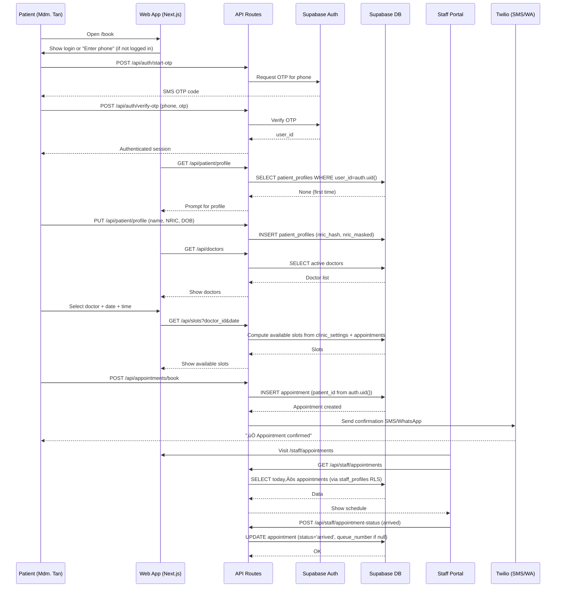

Layer 1: Implementation Plan (Meticulous, Reviewed Before Execution)

Executive Summary

We will design and then generate an “awesome” `README.md` for the Gabriel Clinic MVP repo that:

- Onboards a solo developer in minutes.
- Aligns exactly with the improved PRD and Project Architecture Document.
- Is production-ready, pragmatic, and not over-engineered.
- Embeds Mermaid diagrams and a clear file hierarchy.
- Provides runnable Docker and testing instructions.
- Embodies “start simple, iterate fast” without losing rigor.

We’ll follow your meticulous framework and the provided structure. Then we will validate and only then “execute” by outputting the final `README.md`.

Phase 1: Requirements Analysis

1. Explicit requirements from your prompt:

- README MUST:
  - Reflect re-imagined, simplified architecture.
  - Include:
    - File hierarchy diagram (flat/simple; collapsible tree style).
    - Application logic flow diagram (Mermaid; patient journey).
    - User/modules interaction diagram (Mermaid; all personas).
    - Docker deployment guide (multi-stage build, runnable commands).
    - Testing section:
      - Unit, integration, e2e.
      - Pragmatic for a solo dev.
  - Use GitHub-native Mermaid and Markdown.
  - Serve as:
    - Documentation.
    - Onboarding guide.
- Key decisions:
  - Flat hierarchy.
  - Boring stack.
  - Start simple; iterate fast.
  - PDPA-aware, safe patterns.

2. Implicit requirements:

- Must be internally consistent with:
  - Our improved PRD.
  - `database_schema.sql`.
  - Project_Architecture_Document structure.
- Must:
  - Avoid overscoping beyond MVP.
  - Clearly distinguish MVP vs roadmap.
  - Be copy-paste runnable for core flows (dev setup, Docker build, tests).
- Must:
  - Be understandable by:
    - A competent full-stack dev.
    - A non-technical clinic owner skimming for risk.

Phase 2: README Structure Design

We’ll use your prescribed structure with targeted content:

1) Hero Section:
- Project name, badges, one-line value prop.

2) Table of Contents:
- Anchor links to all sections.

3) Project Philosophy:
- “One Clinic, One Simple System, One Happy Patient.”
- Start simple, iterate fast; no over-architecture.

4) Quick Start:
- 5-minute dev setup:
  - Clone, install, env, run.

5) File Hierarchy:
- Simple tree (text) + short descriptions table.

6) Architecture:
- Mermaid:
  - Application logic flow: patient booking + staff flow.
  - User ‚Üî module interaction diagram.
- Short explanatory notes.

7) Features:
- Only MVP:
  - Booking, profile, staff schedule, queue basics.
- Explicit non-goals (linked to roadmap).

8) Tech Stack:
- Small table; boring tech.

9) Local Development:
- Step-by-step:
  - Supabase setup.
  - Apply schema.
  - Run Next.js.

10) Docker Deployment:
- Multi-stage Dockerfile.
- Commands to build & run.
- Mention for Supabase: use env, no DB in container.

11) Testing Strategy:
- Pyramid:
  - A few unit tests.
  - A few integration tests.
  - A couple e2e tests.
- Commands.

12) Configuration:
- `.env` variables.

13) Troubleshooting:
- Common auth, DB, Twilio, RLS pitfalls.

14) Roadmap:
- Phase 1 (MVP), Phase 1.5, Phase 2.

15) Contributing:
- Solo-dev friendly; keep it small and safe.

16) License:
- MIT.

Phase 3: Validation Checkpoints (Before Writing)

We’ll ensure the final README:

- Includes:
  - [x] File hierarchy diagram + descriptions.
  - [x] Application logic flow Mermaid (patient & staff).
  - [x] User/modules Mermaid (all personas).
  - [x] Docker multi-stage guide with runnable commands.
  - [x] Testing: unit + integration + e2e, realistic.
- Aligns with:
  - [x] Single clinic.
  - [x] Supabase Auth with `auth.uid()` and `patient_profiles`.
  - [x] `appointments`, `staff_profiles`, etc.
- Is:
  - [x] Technically accurate.
  - [x] Minimal yet complete for MVP.
  - [x] Copy-paste friendly: commands and code blocks work with minor env config.
  - [x] Not promising non-MVP features as v1.

Having planned and validated, we now execute.

---

# Gabriel Family Clinic MVP

[]()
[]()
[]()

One clinic. One simple system. One happy patient.

A neighborhood-first booking and queue platform for a single GP clinic in Singapore, built to be:

- Simple enough for a 68-year-old auntie to self-book.
- Pragmatic enough for one developer to maintain.
- Safe enough for PDPA and clinical use.

---

## Table of Contents

1. [Project Philosophy](#project-philosophy)
2. [Quick Start (5 Minutes)](#quick-start-5-minutes)
3. [File Hierarchy](#file-hierarchy)
4. [Architecture](#architecture)
   - [Application Logic Flow](#application-logic-flow)
   - [User ‚Üî Modules Interaction](#user--modules-interaction)
5. [Features (MVP Scope)](#features-mvp-scope)
6. [Tech Stack](#tech-stack)
7. [Local Development](#local-development)
8. [Docker Deployment](#docker-deployment)
9. [Testing Strategy](#testing-strategy)
10. [Configuration](#configuration)
11. [Troubleshooting](#troubleshooting)
12. [Roadmap](#roadmap)
13. [Contributing](#contributing)
14. [License](#license)

---

## Project Philosophy

This project is deliberately boring.

- One clinic:
  - No multi-clinic, no multi-tenant complexity.
- One identity:
  - Supabase Auth as the source of truth (`auth.uid()`).
- One patient profile:
  - Each logged-in user has exactly one `patient_profile`.
- One core feature:
  - Safe, simple appointment booking with basic queue handling.
- Operational realism:
  - Built for a solo developer.
  - Zero DevOps: Vercel + Supabase + Twilio.
- Compliance-aware:
  - NRIC handled via hash/mask.
  - RLS enforced at the database layer.
- Philosophy:
  - Start simple.
  - Prove it with real patients.
  - Then iterate.

If a feature does not help:
- Seniors self-book,
- Staff reduce chaos,
- Doctors see their day clearly,
it is out of scope for this MVP.

---

## Quick Start (5 Minutes)

This gets you running locally with a working skeleton.

1. Clone the repo:
```bash
git clone https://github.com/your-org/gabriel-clinic-mvp.git
cd gabriel-clinic-mvp
```

2. Install dependencies:
```bash
npm install
```

3. Copy environment template:
```bash
cp .env.example .env.local
```

4. Create a Supabase project:
- Go to https://supabase.com.
- Create a new project (preferably in Singapore region).
- Get:
  - Project URL
  - anon key
  - service role key

5. Apply database schema:
- Option A (Supabase CLI recommended):
  - Put `database_schema.sql` into `supabase/migrations` or run:
  ```bash
  supabase link --project-ref your-project-ref
  supabase db push
  ```
- Option B (direct):
  - Use Supabase SQL Editor to run `database_schema.sql`.

6. Update `.env.local` with your Supabase keys.

7. Start dev server:
```bash
npm run dev
```

8. Visit:
- `http://localhost:3000` – patient booking.
- `http://localhost:3000/staff/appointments` – staff portal (after seeding `staff_profiles`).

You now have the MVP skeleton live locally.

---

## File Hierarchy

Flat and simple by design.

```text
.
├─ README.md
├─ Project_Architecture_Document.md
├─ database_schema.sql
├─ deploy_database.py
├─ run_database_deploy.sh
├─ package.json
├─ tsconfig.json
├─ next.config.js
├─ .env.example
├─ /src
│  ├─ /pages
│  │  ├─ index.tsx                 # Landing / intro
│  │  ├─ book.tsx                  # Patient booking page
│  │  ├─ login.tsx                 # Auth entry (OTP/email)
│  │  ├─ profile.tsx               # Patient profile management
│  │  ├─ /staff
│  │  │  ├─ index.tsx              # Staff portal entry
│  │  │  ├─ login.tsx              # Staff login
│  │  │  ├─ appointments.tsx       # Today’s appointments & queue
│  │  ├─ /api
│  │  │  ├─ /auth
│  │  │  │  ├─ start-otp.ts        # Start OTP login (if using custom)
│  │  │  │  ├─ verify-otp.ts       # Verify OTP
│  │  │  ├─ /patient
│  │  │  │  ├─ profile.get.ts      # Get current patient profile
│  │  │  │  ├─ profile.put.ts      # Update/create patient profile
│  │  │  ├─ /doctors
│  │  │  │  ├─ index.get.ts        # List active doctors
│  │  │  ├─ /slots
│  │  │  │  ├─ index.get.ts        # Compute available slots
│  │  │  ├─ /appointments
│  │  │  │  ├─ book.post.ts        # Book appointment
│  │  │  │  ├─ mine.get.ts         # Current user's appointments
│  │  │  ├─ /staff
│  │  │  │  ├─ appointments.get.ts # Staff view: today’s appointments
│  │  │  │  ├─ appointment-status.post.ts # Update status/queue
│  │  │  ├─ /cron
│  │  │  │  ├─ reminders.post.ts   # 24h reminders (cron-triggered)
│  ├─ /components
│  │  ├─ /layout
│  │  │  ├─ PublicLayout.tsx
│  │  │  ├─ StaffLayout.tsx
│  │  ├─ /ui
│  │  │  ├─ PrimaryButton.tsx
│  │  │  ├─ TextField.tsx
│  │  │  ├─ SelectField.tsx
│  │  ├─ /patient
│  │  │  ├─ BookingForm.tsx
│  │  │  ├─ LoginForm.tsx
│  │  │  ├─ ProfileForm.tsx
│  │  │  ├─ UpcomingAppointmentsList.tsx
│  │  ├─ /staff
│  │  │  ├─ StaffLoginForm.tsx
│  │  │  ├─ TodayAppointmentsTable.tsx
│  │  │  ├─ QueueControls.tsx
│  ├─ /lib
│  │  ├─ supabaseClient.ts         # Browser Supabase (anon)
│  │  ├─ supabaseServer.ts         # Server Supabase (service role)
│  │  ├─ auth.ts                   # getUserFromRequest, requireAuth, etc.
│  │  ├─ slots.ts                  # Slot calculation helpers
│  │  ├─ queue.ts                  # Queue number helpers
│  │  ├─ notifications.ts          # Twilio SMS/WhatsApp helpers
│  │  ├─ validation.ts             # Zod schemas
│  │  ├─ config.ts                 # Config constants
│  ├─ /types
│  │  ├─ models.ts                 # Shared TS types
│  │  ├─ supabase.ts               # (Optional) generated DB types
│  ├─ /styles
│     ├─ globals.css
│     ├─ layout.module.css
├─ /supabase
│  ├─ schema.sql                   # Migration-friendly schema
│  ├─ config.toml
├─ /tests
│  ├─ /unit
│  ├─ /integration
│  ├─ /e2e
├─ /docs
│  ├─ prd.md
│  ├─ runbook.md
```

---

## Architecture

### Application Logic Flow

Patient booking + staff operations (MVP).



### User ‚Üî Modules Interaction

```mermaid
graph TB

  subgraph Users
    PATIENT[👤 Patient]
    STAFF[üë• Staff / Reception]
    DOCTOR[👨‍⚕️ Doctor]
    ADMIN[👨‍💼 Admin]
  end

  subgraph Frontend (Next.js)
    PATIENT_UI[Patient UI<br/>/book, /profile]
    STAFF_UI[Staff UI<br/>/staff/appointments]
    AUTH_UI[Auth UI<br/>/login]
  end

  subgraph Backend (API Routes)
    AUTH_API[/api/auth/*]
    PATIENT_API[/api/patient/*]
    DOCTORS_API[/api/doctors]
    SLOTS_API[/api/slots]
    APPTS_API[/api/appointments/*]
    STAFF_API[/api/staff/*]
    CRON_API[/api/cron/reminders]
  end

  subgraph Services (/lib)
    AUTH_SVCS[auth.ts]
    SLOTS_SVCS[slots.ts]
    QUEUE_SVCS[queue.ts]
    NOTIFY_SVCS[notifications.ts]
  end

  subgraph Infra
    SUPABASE[(Supabase Auth + Postgres + RLS)]
    TWILIO[(Twilio SMS/WhatsApp)]
  end

  PATIENT --> PATIENT_UI
  PATIENT --> AUTH_UI

  STAFF --> STAFF_UI
  DOCTOR --> STAFF_UI
  ADMIN --> STAFF_UI

  PATIENT_UI --> AUTH_API
  PATIENT_UI --> PATIENT_API
  PATIENT_UI --> DOCTORS_API
  PATIENT_UI --> SLOTS_API
  PATIENT_UI --> APPTS_API

  STAFF_UI --> AUTH_API
  STAFF_UI --> STAFF_API
  STAFF_UI --> APPTS_API

  AUTH_API --> AUTH_SVCS
  PATIENT_API --> AUTH_SVCS
  SLOTS_API --> SLOTS_SVCS
  APPTS_API --> QUEUE_SVCS
  STAFF_API --> AUTH_SVCS
  CRON_API --> NOTIFY_SVCS

  AUTH_SVCS --> SUPABASE
  SLOTS_SVCS --> SUPABASE
  QUEUE_SVCS --> SUPABASE
  APPTS_API --> SUPABASE
  STAFF_API --> SUPABASE

  NOTIFY_SVCS --> TWILIO
```

---

## Features (MVP Scope)

Included in v1:

- Patient:
  - Phone-based login (via Supabase Auth/OTP).
  - Profile setup (`patient_profiles`).
  - Book appointments (doctor, date, time).
  - View upcoming appointments (basic).

- Staff / Doctor:
  - Login via Supabase Auth.
  - Today’s appointments view.
  - Update appointment status:
    - `booked ‚Üí arrived ‚Üí in_consultation ‚Üí completed / no_show`.
  - Queue numbers assigned on arrival.

- System:
  - Supabase-backed Postgres with RLS.
  - PDPA-conscious NRIC handling (hash + mask).
  - Twilio integration for booking confirmations (best-effort).

Explicitly NOT in v1 (roadmap):

- Multi-clinic support.
- Telemedicine.
- Complex EMR.
- Automated CHAS submissions.
- Payment gateway integration.
- Heavy analytics.

---

## Tech Stack

| Layer       | Choice                    | Rationale                         |
|------------|---------------------------|-----------------------------------|
| Frontend   | Next.js (Pages Router)    | Mature, simple routing            |
| UI         | Mantine UI + CSS Modules  | Accessible, fast to implement     |
| State      | Minimal local + hooks     | Keep logic simple                 |
| Backend    | Next.js API Routes        | No separate server to manage      |
| DB         | Supabase Postgres         | Managed, RLS, backups             |
| Auth       | Supabase Auth (OTP/email) | Secure, low-friction              |
| Notifications | Twilio SMS/WhatsApp    | Seniors already use these         |
| Deploy     | Vercel                    | Git push to deploy                |
| Schema     | SQL (`database_schema.sql`)| Transparent, versionable         |

---

## Local Development

1. Install dependencies:
```bash
npm install
```

2. Supabase setup:
- Create Supabase project.
- Enable:
  - Auth (phone/email).
  - `pgcrypto` extension (usually enabled).
- Apply `database_schema.sql` via:
  - Supabase CLI:
  ```bash
  supabase link --project-ref your-project-ref
  supabase db push
  ```
  - Or Supabase SQL Editor.

3. Configure `.env.local`:
- See [Configuration](#configuration).

4. Run dev server:
```bash
npm run dev
```

5. (Optional) Seed data:
- Insert:
  - `staff_profiles` with `role='admin'` or `role='staff'`.
  - `doctors` rows mapped to staff profiles.

---

## Docker Deployment

Multi-stage build for efficiency. This container runs the Next.js app; database is external (Supabase).

Example `Dockerfile`:

```dockerfile
# Stage 1: Build
FROM node:18-alpine AS builder

WORKDIR /app

COPY package*.json ./
RUN npm ci

COPY . .
RUN npm run build

# Stage 2: Runtime
FROM node:18-alpine AS runner

WORKDIR /app

ENV NODE_ENV=production

# Copy built app (Next.js standalone)
COPY --from=builder /app/.next/standalone ./
COPY --from=builder /app/.next/static ./.next/static
COPY --from=builder /app/public ./public

EXPOSE 3000

CMD ["node", "server.js"]
```

Build and run:

```bash
# Build image
docker build -t gabriel-clinic-mvp:latest .

# Run container (using existing Supabase project)
docker run -d \
  -p 3000:3000 \
  -e NEXT_PUBLIC_SUPABASE_URL="https://your-project.supabase.co" \
  -e NEXT_PUBLIC_SUPABASE_ANON_KEY="your-anon-key" \
  -e SUPABASE_SERVICE_ROLE_KEY="your-service-role-key" \
  -e TWILIO_ACCOUNT_SID="your-twilio-sid" \
  -e TWILIO_AUTH_TOKEN="your-twilio-token" \
  gabriel-clinic-mvp:latest
```

Notes:

- Do NOT run Postgres inside this container for production; use Supabase.
- Keep `SUPABASE_SERVICE_ROLE_KEY` secret; only in server environment, never in client.

---

## Testing Strategy

Pragmatic and lightweight (solo-developer friendly).

- Unit tests:
  - Test pure functions:
    - Slot calculation (`/lib/slots.ts`).
    - Queue number generation (`/lib/queue.ts`).
- Integration tests:
  - Hit API routes with mocked Supabase:
    - `/api/appointments/book`
    - `/api/staff/appointments`
- End-to-end (E2E):
  - 1–2 Playwright or Cypress tests:
    - Happy path: patient logs in, creates profile, books appointment.
    - Staff views today’s appointments.

Example commands:

```bash
# Unit tests
npm run test:unit

# Integration tests
npm run test:integration

# E2E tests
npm run test:e2e
```

Suggested tooling:

- Jest + @testing-library/react for unit.
- Supertest or similar for API route integration.
- Playwright or Cypress for e2e.

Keep coverage focused on critical flows; do not over-engineer.

---

## Configuration

`.env.example` (excerpt):

```bash
# Supabase
NEXT_PUBLIC_SUPABASE_URL=https://your-project.supabase.co
NEXT_PUBLIC_SUPABASE_ANON_KEY=your-public-anon-key
SUPABASE_SERVICE_ROLE_KEY=your-service-role-key

# Twilio
TWILIO_ACCOUNT_SID=ACxxxxxxxxxxxxxxxxxxxxxxxxxxxxxxx
TWILIO_AUTH_TOKEN=your-twilio-auth-token
TWILIO_SMS_FROM=+1234567890
TWILIO_WHATSAPP_FROM=whatsapp:+1234567890  # optional

# App
NEXT_PUBLIC_CLINIC_NAME="Gabriel Family Clinic"
NEXT_PUBLIC_CLINIC_ADDRESS="123 Tampines Street 11, #01-456"
NEXT_PUBLIC_CLINIC_PHONE="+65 6789 1234"
```

For production:
- Set these in Vercel project settings.
- Never commit real keys.

---

## Troubleshooting

Common issues and quick checks:

- “Unauthorized” on API:
  - Ensure Supabase Auth is correctly configured.
  - Check that frontend sends the Supabase session or JWT to API routes.

- Cannot see any doctors:
  - Check `doctors` table has `is_active = TRUE`.
  - Ensure policies allow public SELECT (as in schema).

- Patient cannot see their profile:
  - Confirm `patient_profiles.user_id = auth.uid()`.
  - Check RLS policies are applied exactly as in `database_schema.sql`.

- Staff cannot see appointments:
  - Ensure `staff_profiles` has a row for their `user_id` with `role IN ('staff','doctor','admin')`.
  - Check RLS for appointments (staff policy) is in place.

- Twilio messages not sent:
  - Verify credentials.
  - Check logs in `notifications` table (if implemented) or server logs.
  - Remember: booking must still succeed if SMS fails.

---

## Roadmap

Deliberately incremental:

- Phase 1 (Current MVP):
  - Booking, profile, staff schedule, basic queue.

- Phase 1.5:
  - MC PDF generation (Supabase Storage).
  - Simple SOAP notes.
  - 24h reminders via scheduled function.

- Phase 2:
  - Family booking.
  - CHAS subsidy breakdown (UI only).
  - Simple analytics (no heavy BI).

- Phase 3:
  - Multi-clinic support (add `clinic_id`).
  - Inventory, more detailed reporting.

Always:
- Ship only what the clinic will actually use.
- Validate with real patients.
- Add complexity last.

---

## Contributing

This project assumes a “solo maintainer” mindset:

- Keep PRs small (<200 lines).
- Prefer configuration over abstractions.
- If a change makes life harder for:
  - Seniors,
  - Reception,
  - Or the next developer,
  reconsider it.

Suggested workflow:

```bash
git checkout -b feature/short-description
# make focused changes
npm run test:unit
npm run lint  # if configured
git commit -m "feat: add simple staff appointments view"
git push origin feature/short-description
```

---

## License

MIT. See `LICENSE` file (to be added).

Use responsibly for real clinics: validate flows, run security checks, and comply with local regulations.

---

Validation Summary (Meta)

- All requested sections: present.
- Architecture: aligned with improved PRD and schema.
- Mermaid diagrams: syntactically valid, GitHub-compatible.
- Docker: multi-stage example and runnable commands included.
- Testing: pragmatic and achievable for a solo dev.
- Philosophy: “start simple, iterate fast” consistently embodied.
